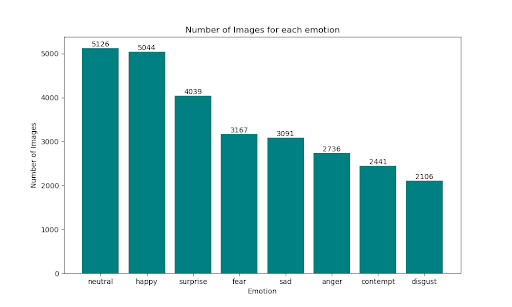

# Detect Emotions from Facial Expressions
by Andrew Seefeldt

## Problem Statement
Detecting emotions based solely on facial expressions is notoriously tricky for humans. It is common to misread facial expressions. Therefore, it is important to ensure that we are expressing our non-verbal communication as clearly as humanly possible. Unfortunately, we can’t see ourselves without a mirror or camera, so it is tricky to understand what our facial expressions are saying. This problem is compounded if you are neurodivergent or have experienced trauma.

The objective of this project is to use artificial intelligence to illuminate what your facial expression may be communicating. By using your webcam you will be able to see what your current expression is saying and adjust your facial expression as needed. This project will help those who are neurodivergent build the mussel memory needed to express their emotions as. It will also help professionals become aware of their facial expressions and if they are sending unintended messages.

## Data-Dictionary
Data came from Kaggle and consisted of colored photos of people expressing anger (3,220 individual images), contempt (2,872), sadness (3,092), fear (3,177), disgust(2,478), happiness(5,045), surprise (4,041), and neutrality (5,128).

## Executive Summary
### Background and Purpose
According to researchers around 55% of our communication with others is non-verbal. Over half of what we communicate does not come out of our mouths. Non-verbal communication is a complex topic, but when you are on a video call, it becomes painfully reliable on facial expressions. Facial expressions are complex and can be difficult to understand. Additionally, we can not see our facial expressions without a mirror or camera. That means we may be able to read facial expressions, but is our face sending the messages we think they are? Unfortunately, probably not, at least not 100% of the time. This problem is worsened for those who are neurodiverse or have had traumatic events in their lives.

Neurodivergent people can struggle with self-expression, and facial expressions are no exception. People with traumatic events in their lives can suffer from a ‘resting angry face’ (RAF) at a higher rate than others. The catch is that these populations generally are unaware of their miscommunications unless directly told.

These populations would greatly benefit from an AI model that can indicate their facial communications and help them understand the messages they are sending. That is the point of this project, to create a tool to help people understand how they communicate with others. By creating such a tool, we can empower people to be more confident and comfortable in their own skin and help them reach their full potential.

WARNING: This is not a tool to read other people. We can all wear masks at times and no human or AI can read what is going on in someone's brain. This is a tool for self-discovery only and not to be used to judge others.

### Data
Data came from Kaggle and consisted of colored photos of people expressing anger (3,220 individual images), contempt (2,872), sadness (3,092), fear (3,177), disgust(2,478), happiness(5,045), surprise (4,041), and neutrality (5,128). Each category was split into 70% train, 15% valuation, and 15% test.

This is a portion of the AffectNet dataset. AffectNet is a dataset of over 400,000 facial images divided into the above emotions and scored by valence and arousal. However, the Kaggle dataset that I used is 29,000 images without the valence and arousal scores.

The images were screened and unclear images, images that had large writing over the face, and mislabeled images were removed. The above numbers reflect the categories once they were screened.

Once the data was screened and split into train, val, and test folders; it was resized to 244 pixels by 244 pixels. The labeling of the X and the Y was performed by a function so that the data could be read in batches.

As the dataset was limited the following random data augmentation was done for each photo: rotation of up to 45 degrees, width shift of up to 20%, height shift of up to 20%, sheer range of up to 20%, zoom range of up to 20%, and brightness was lowered or raised by 20%. These images and the original were fed into the model creating an artificial dataset of 203,000 images.

You can see, in the table below, that neutral and happiness are the highest two categories.

### Modeling
Due to the complex nature of image data, a CNN model was chosen for this project. At first a simple neural net of 3 layers with 8 nodes each was attempted. However, time and computer restraints led to the implementation of three transfer learning models.

MobileNet V2 was used first to see what sort of accuracy could be achieved with a base model. The image augmentation was reduced to just rotation to save time in fitting the model. The first model included all image types. The highest valuation score was 17% compared to the baseline (8 categories) of 12.5% or an increase of 4.5%. The test accuracy was 24%. This model was used with some demo photos that consisted of random pictures from each emotion and a few celebrities with resting angry faces. Unfortunately, this model predicted that everyone was surprised or almost surprised. This model ranked surprised as each images first or second emotion.

Next a DenseNet model with all of the data augmentation was fit. This model did not include neutral images. The validation accuracy peaked at 73% with the best valuation accuracy was 33%. The test accuracy was 23%. As there were 7 categories the base was 14% so we had an increase of 9% from base to test. Unfortunately, this model predicted that everyone is angry… like really angry (80% or higher) for most images. Even a smiling Bill Ney scored 90% for anger.

After some research, it was concluded that a resnet50 model may provide better results while not using too many computing resources.

A Resnet50 model was fit using the full data preprocessing detailed above but did not use the neutral category. The training accuracy was 65% with a valuation score of 27% and a test score of 24%. which puts the model 10% higher than the baseline. However, this time the emotion was contempt.

The next model was trained on 4 emotion image sets; anger, fear, sadness, and happiness. The number of augmentations was also reduced to just rotation. It appears that the model is struggling to tell very similar emotions apart, which is not surprising as humans struggle with that as well. This model scored at 23% just under the baseline of 25%.

As an experiment, the happiness folder was reduced to be around the same size as the other folders (around 3,000 images). This produced a model with 33% accuracy, however, it leaned towards fear when sent through the demo.

The final model was trained with all the augmentation listed above. That model scored a 22% on the test data. It was an angry little model.

The next step was to ensemble the last 3 models to see if they produced a better score. They produces a score slightly above the second model, but it rounded down to 33%.

Unfortunately with ensembling and boosting, the model performance was not significantly improved.

The two highest performing models were the DenseNet and the MobileNet at 10% and 9% above base. They both leaned towards one emotion. However, the MobileNet did a better job predicting secondary classes, or the ones that it did not pick as the main class. This was obvious because the DenseNet just didn’t bother and gave all secondary classes the same average score while the MobileNet generally had the correct emotion as the number two if it got the image incorrect (only a subset of demo images were viewed).

The two below images were both scored as angry. However, in the first one you may consider her surprised instead, but the MobileNet model scored surprised as the second emotion.

The second was also scored as angry with surprise as his second as well.

The model is far from perfect, but it did score 9% above base. It may not be able to be a stand-alone tool to help identify your emotions, but it could be used with other resources to help understand what you are communicating with your facial expressions.

## Insights
Emotions are hard, so is image recognition, and so is running a CNN model on a shoestring budget. There were some interesting insights on this project.

As the author was going through the images, he almost became ‘noise-blind’ to the different images of emotions to the point that the author was struggling to tell the difference between seemingly opposite emotions of happiness and anger. Compare this to emotions such as contempt and disgust. It was almost impossible for the author to correctly tell disgust, anger, and contempt apart throughout the project. These facial expressions are so similar that it is not a surprise that the model struggled.

Additionally, the author found that surprise was easily confused with happiness or anger. Those images are as if someone has hit the pause button and we are waiting to see if the situation is one of joy, anger, or sadness.

The below image of John Snow is in the category of sadness. That may be correct, but the image next to him is of fear. Now the difference is subtle at best. Could the average person tell the difference and correctly guess? Emotions are hard.
.png)

The author is tempted to say ‘garbage in so garbage out’, but that would be unfair. It isn’t that the images are wrongly orginzed, it is that emotions are subjective, so therefore uncertain at best. For that exact reason, there is no substitute for communication when dealing with others especially when dealing with emotions (I am as disappointed as you are).

It was also interesting that the models seemed to favor one feeling over the others. The interesting thing is that it was never the biggest dataset as one would predict. The most common emotion was anger. This is fascinating as it seems to be a reflection of humanity itself. We all know people that seem to be constantly angry or negative. I dare not draw any further conclusions besides a reminder to myself that there is too much anger in the world and to strive to be a light of happiness to others.

Because of the similar images and facial expressions, this is a challenging problem to solve based only on still images. Ultimately that is something not even humans do on a regular basis. We rarely do not judge an emotional response solely on a single image. We are constantly taking in images and building our understanding based on a series of data. It would be interesting to see how well a learning model could pick up patterns based on gifs instead of images.

## Conclusion
The model did not perform as well as the author hoped. However, with further refinement, a model could be helpful for refining how we are communicating with others. Emotions are hard, and that may be doubly true for artificial intelligence and technology. However, if we continue to strive to help the neurodivergent and those with a history of trauma refine and better themselves we can grow. We can grow, not only as an individual but also as a society that embraces all people despite their learning challenges.

As this project demonstrates, those who struggle with emotions can use technology to help with their personal growth and betterment, but we still need human assistance in achieving our full potential. After all, we are not attempting to reach our potential for machines, but for humans (may that be ourselves or those close to us). That assistance can be a friend, mentor, or therapist, and technology can help in growth. When it comes to becoming a better human, it appears that humans are still the best assistant and may always be.

## Next Steps
### Model
Remove the background from the pictures to reduce noise

Increase the sample size by using Google API to find additional images based on their search algorithms.

Adjust image augmentation parameters to fine-tune the model

Adjust the model performance by trying other transfer learning models such as DenseNet.

### Production
Get someone who isn’t colorblind to pick the layover color of the model.

Package the model into an app for easy deployment

## Notes 
The image folder is a sampling of the data set and not the full dataset.  Here is a link to the full dataset: https://www.kaggle.com/datasets/noamsegal/affectnet-training-data?select=neutral

My models are not included in the repo.  Please message me to gain access to those models.  

## References
“Do You Know How Much of Communication is Nonverbal?” 2020. London Image Institute. https://londonimageinstitute.com/how-much-of-communication-is-nonverbal/. Gillbee, Kim. 2016. “The Psychology Of Resting Bitch Face Syndrome And What You Can Do About it.” HuffPost. https://www.huffpost.com/entry/the-psychology-of-resting-bitch-face-syndrome-and-what_b_57bd18fce4b07d22cc3a3055. “Introduction to Keras for Engineers.” 2020. Keras. https://keras.io/getting_started/intro_to_keras_for_engineers/. “IO tools (text, CSV, HDF5, …) — pandas 2.0.3 documentation.” n.d. Pandas. Accessed August 1, 2023. https://pandas.pydata.org/pandas-docs/stable/user_guide/io.html#json. n.d. ChatGPT. Accessed August 1, 2023. https://chat.openai.com/. “IO tools (text, CSV, HDF5, …) — pandas 2.0.3 documentation.” n.d. Pandas. Accessed August 1, 2023. https://pandas.pydata.org/pandas-docs/stable/user_guide/io.html#pickling. “Quick start guide — Matplotlib 3.7.2 documentation.” n.d. Matplotlib. Accessed August 1, 2023. https://matplotlib.org/stable/tutorials/introductory/quick_start.html#sphx-glr-tutorials-introductory-quick-start-py.